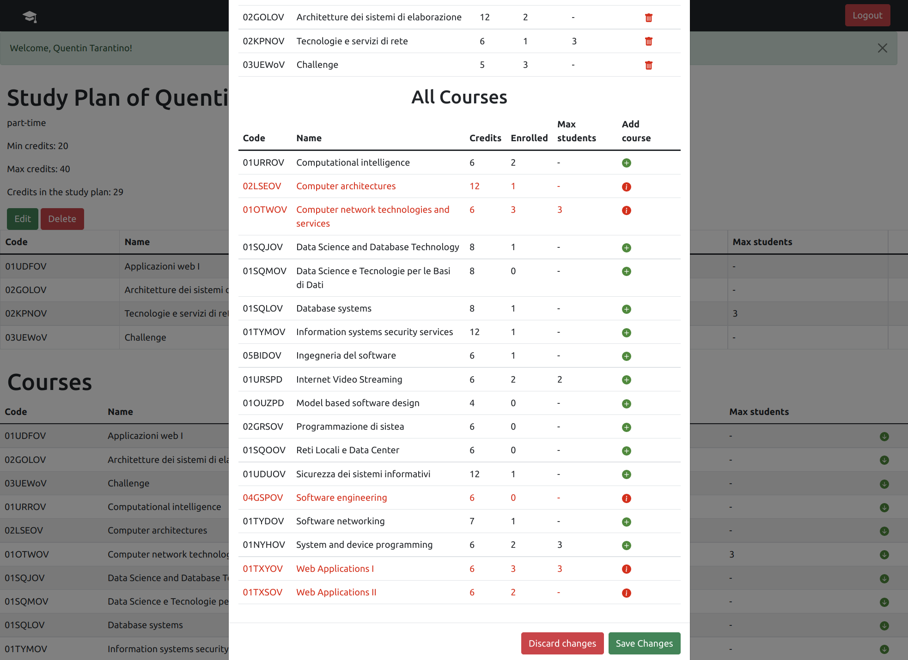

# Exam #1: "Study Plan"
## Student: s301131 Coppoletta Gaetano 

## React Client Application Routes

- Route `/`: if the user is logged in it shows the courses and the study plan (if any) or the buttons to create a new study plan (if the study plan has not been created before), if the user is not logged in it shows only the courses.
- Route `/login`: This route shows the login page, where the user can insert usename and password in order to perform authentication.
- Route `*` : This routes redirect the user to `/`.

## API Server

- POST `/api/sessions`
  - Request parameters:
  ```
    {
      username: "s000000@studenti.polito.it"
      password: "password0"
    }
  ```
  - Response header: ```201``` (success)
  - Response body content:
  
  ```
  user: {
    id: 1,
    username: 's000000@studenti.polito.it',
    name: 'Michael Jordan'
  }
  ```

- GET `/api/session/current`
  - Request parameters: ```empty```
  - Request body: ```empty```
  - Response header: ```200``` OK (success), ```401``` Not authenticated
  - Response body content: 
   ```
    user: {
    id: 1,
    username: 's000000@studenti.polito.it',
    name: 'Michael Jordan'
    }
   ```

- DELETE `/api/sessions/current`
  - Request parameters and body content: ```empty```
  - Response header: ```200``` OK (success)
  - Response body content: ```empty```


- GET `/api/courses`
  - **Return an array containing all courses sorted by name**.
  - Request parameters and body content: ```empty```
  - Response header: `200` OK (success), `500` Internal server error;
  - Response body: An array of courses sorted by name
  ```
  [
    {
      "code": "01UDFOV",
      "name": "Applicazioni web I",
      "credits": 6,
      "enrolled": 0,
      "maxstudents": null,
      "preparatory": null,
      "incompatible": [
        {
          "Incompatible": "01TXYOV",
          "name": "Web Applications I"
        }
      ]
    },
    {
      "code": "02GOLOV",
      "name": "Architetture dei sistemi di elaborazione",
      "credits": 12,
      "enrolled": 0,
      "maxstudents": null,
      "preparatory": null,
      "incompatible": [
        {
          "Incompatible": "02LSEOV",
          "name": "Computer architectures"
        }
      ]
    }, ....
  ]
  
  ```
- GET `api/studyPlanCourses`
  - **Get the courses of the studyPlan of the user**
  - User id is provided by passport session
  - Request parameters and body conyent: ```empty```
  - Response header: `200` OK (success), `500` Internal server error;
  - Response body: An array of courses
   ```
  [
    {
      "code": "01UDFOV",
      "name": "Applicazioni web I",
      "credits": 6,
      "enrolled": 0,
      "maxstudents": null,
      "preparatory": null,
      "incompatible": [
        {
          "Incompatible": "01TXYOV",
          "name": "Web Applications I"
        }
      ]
    },
    {
      "code": "02GOLOV",
      "name": "Architetture dei sistemi di elaborazione",
      "credits": 12,
      "enrolled": 0,
      "maxstudents": null,
      "preparatory": null,
      "incompatible": [
        {
          "Incompatible": "02LSEOV",
          "name": "Computer architectures"
        }
      ]
    }, ....
  ]
  
  ```
- GET `/api/hasStudyPlan`
  - **Get the study plan type of the user**
  - User id is provided by passport session
  - Request parameters and body conyent: ```empty```
  - Response header: `200` OK (success), `500` Internal server error;
  - Response body: The study plan type
  ```
  {StudyPlan: 'full-time'}
  ```

- DELETE `/api/studyPlan`
  - **Delete the study plan of the user**
  - Request parameters and body conyent: ```empty```
  - Response header: `204` OK (success), `500` Internal server error;
  - Response body: ```empty```

- PUT `api/saveStudyPlan/:type`
  - **Modify the study plan of the user, delete the previous one and insert new one**
  - User id is provided by passport session
  - Request parameters: ```type: 'full-time'```
  - Request body: 
     ```
    [
      {
        "code": "01UDFOV",
        "name": "Applicazioni web I",
        "credits": 6,
        "enrolled": 0,
        "maxstudents": null,
        "preparatory": null,
        "incompatible": [
          {
            "Incompatible": "01TXYOV",
            "name": "Web Applications I"
          }
        ]
      },
      {
        "code": "02GOLOV",
        "name": "Architetture dei sistemi di elaborazione",
        "credits": 12,
        "enrolled": 0,
        "maxstudents": null,
        "preparatory": null,
        "incompatible": [
          {
            "Incompatible": "02LSEOV",
            "name": "Computer architectures"
          }
        ]
      }, ....
    ]
  
    ```
  - Response header: `200` OK (success), `422` Validation of the constraints failed, `500` Internal server error;

## Database Tables

- Table `Users` - contains id, email, password, salt, name, StudyPlan
- Table `Courses` - contains code, name, credits, maxstudents, preparatory, enrolled 
- Table `StudyPlans` - studentId, courseId
- Table `Incompatible_courses` - Code, Incompatible

## Main React Components

- `Homepage` (in `App.js`): Renders the component that should always been visible e.g Navbar and alert message (if any)
- `StudyPlan` (in `StudyPlanTable.js`): This components is used to render the study plan if the user has got one, if the user doesn't have a study plan, the buttons that allow the creation of a study plan are showed. It also contains the modal used in "edit" mode, this is showed only when the state "editable" is true.
- `MyModal` (in `MyModal.js`): This component is showed only in "edit" mode. It allows the insertion or removal of the courses in the study plan.
- `CourseTable` (in `CourseTable.js`): This componet is used to show the table containing all courses.
- `StudyPlanRow` (in `StudyPlanRow.js`): It represents a row of the study plan table, both in the "/" route and in the modal, it colors in different way the row or show different icons according to the course information .
- `CourseRow` (in `CourseRow.js`): It represents a row of the course table, both in the "/" route and in the modal, it colors in different way the row or show different icons according to the course information .
- `LoginForm` (in `AuthComponents.js`): This components renders the login form

## Screenshot



## Users Credentials

- s000000@studenti.polito.it, password0
- s000001@studenti.polito.it, password1
- s000002@studenti.polito.it, password2
- s000003@studenti.polito.it, password3
- s000004@studenti.polito.it, password4

## Other information
  - Full courses:
    - Computer network technologies and services
    - Internet Video Streaming
    - Web Applications I